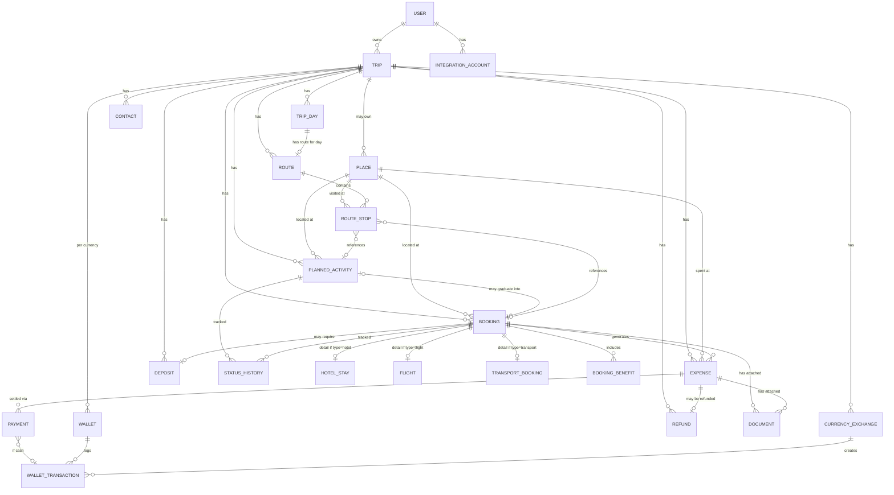

# מערכת ניהול טיולים אישית — ארכיטקטורה מתוקנת (גרסה 2)

**סטטוס: אושר בפועל. שלב 0 (תשתית) בתהליך בנייה. ראה `docs/PHASE_0_REPORT.md` לדוח המעודכן.**

**עדכון**: קיבלנו ממך הודעה מפורטת מאוד עם מפרט מלא לכל המערכת (Trip Day, Places, ספרייה גלובלית, Booking/Expense/Payment, ארנק רב-מטבעי, מלונות, טיסות, מוניות, ביטוח, מפה, דוחות, התראות, אופליין ועוד). בדקתי את המפרט הזה מול הסכימה שכבר קיימת ב-`packages/db/prisma/schema.prisma` (36 טבלאות, 26 enums) — היא כבר מכסה כמעט את כל המפרט, כולל דברים שלא היו במסמך הזה במקור: Insurance, TripCompanion + BookingParticipant (בסיס לריבוי משתתפים), NotificationPreference, TransportQuote, אזורי זמן IANA מלאים על Flight/TransportBooking, DataSource לכל רשומה. **פער אחד אמיתי שנמצא**: טיפים נשמרים כרגע רק כ-`ExpenseCategory.tip` כללי, בלי שדות ייעודיים (למי ניתן, קטגוריית טיפ: מנקה/בל בוי/מלצר/נהג/מסאז'יסט/מדריך/אחר) כפי שביקשת בסעיף "טיפים". זה ייפתר בעיצוב מודל ה-Expense בשלב 1, לא בשלב 0 (שהוא תשתית בלבד).

**החלטות פתוחות מהגרסה הקודמת של המסמך — נסגרו לפי המפרט החדש:**
1. **Planned Activity לא מחזיקה `partially_paid`/`paid`** — המפרט החדש מאשר זאת במפורש ("Planned Activity לא צריכה לשמור סטטוסי תשלום"). סגור, ללא שינוי.
2. **תזמון Booking.com לשלב 5** — נשאר כפי שהוצע; המפרט החדש לא ביקש שינוי בעדיפות, רק הדגיש "אין scraping ואין עקיפת התחברות", וזה כבר העיקרון שהאדריכלות מבוססת עליו.
3. **אישור כללי על ה-ERD ורשימת הטבלאות** — אושר בפועל דרך המפרט המפורט (הוא תואם כמעט לחלוטין את המודל הקיים).
4. **4 ההמלצות הנוספות (Currency, Soft Delete, Notification Preference, ספריות גלובליות)** — כולן כבר ממומשות בסכימה הקיימת ואושרו בפועל דרך המפרט (הוא דורש את כולן במפורש: "Soft Delete... אסור למחוק מידע חשוב באופן בלתי הפיך", "ספריית Places גלובלית", טבלת Currency, והתראות לפי סוג אירוע).

---

## עדכון שני — אבטחה/RLS לפני חיבור Supabase, ומערכת Weather

### מפתחות Supabase — עודכן לפורמט הנוכחי (בדקתי בתיעוד הרשמי, אוגוסט 2026)
Supabase עברו למפתחות `sb_publishable_...` / `sb_secret_...` במקום `anon`/`service_role` הישנים (שיוצאים משימוש עד סוף 2026; שני הפורמטים תקינים בתקופת המעבר). הקוד עודכן לשמות: `NEXT_PUBLIC_SUPABASE_PUBLISHABLE_KEY` (בטוח ללקוח, נשען על RLS) ו-`SUPABASE_SECRET_KEY` (שרתי בלבד, עוקף RLS — נטען עם `import "server-only"` כדי שבנייה תיכשל אם ייובא בטעות לקוד לקוח). מקור: [Migrating to publishable and secret API keys](https://supabase.com/docs/guides/getting-started/migrating-to-new-api-keys).

### RLS — עוצב, טרם הופעל (אין עדיין DB חי)
נכתב `packages/db/prisma/rls_policies.sql` — מדיניות RLS מלאה לכל 38 הטבלאות (לא רק לטבלאות שלב 1), כי Supabase חושף את כל ה-schema הציבורי דרך ה-API אלא אם RLS מגביל אותו — טבלה בלי RLS פתוחה לגמרי. עקרונות:
- **`User.id` חייב להיות שווה בדיוק ל-`auth.uid()`** — טריגר `handle_new_auth_user` יוצר את שורת `public.users` אוטומטית עם ההרשמה, כדי שכל בדיקת בעלות תעבוד.
- פונקציות עזר (`is_trip_owner`, `is_booking_owner` וכו') מונעות כפילות קוד ומאפשרות בדיקת בעלות גם דרך שרשראות יחסים (Payment→Booking/Expense→Trip, WalletTransaction→Wallet→Trip, RouteStop→Route→TripDay→Trip).
- **פער אמיתי שנמצא ותוקן בסכימה**: ל-`Place` (הספרייה הגלובלית) ול-`Contact` (כשלא משויך לטיול) ול-`StatusHistory` **לא היה בכלל `userId`** — כלומר בלי התיקון, ברגע שיהיה יותר ממשתמש אחד, הנתונים האלה היו גלויים/ניתנים לעריכה לכל משתמש. נוסף `userId` לשלושתם.
- כתיבה למטמון מזג האוויר (למטה) נעשית רק דרך `lib/supabase/admin.ts` (Secret key) — אין policy ל-insert/update/delete מהלקוח בכוונה.
- **איך זה ייושם בפועל**: `prisma migrate dev --name init` (טבלאות) ואז `prisma migrate dev --create-only --name enable_rls` + הדבקת תוכן הקובץ + `prisma migrate dev` — כך ה-RLS נשאר חלק ממש מהיסטוריית ה-Migrations, לא סקריפט צדדי.

### מערכת Weather — ארכיטקטורה מוכנה, לא מחוברת עדיין
נוספו לסכימה `WeatherForecastSnapshot` ו-`WeatherAlert` (cache גלובלי לפי מיקום+זמן, לא נתוני משתמש) ול-`packages/shared-types` — `WeatherProvider` (ממשק TypeScript לספק, על אותו עיקרון כמו `IntegrationProvider` בסעיף 9 למטה — מאפשר להחליף ספק בלי לשנות את שאר המערכת).

**עקרונות מפתח (לפי המפרט המפורט שלך):**
- **Cache לפי מיקום (lat/lng מעוגל) + זמן, לא לפי ישות** — Trip/TripDay/Place/PlannedActivity/Route/RouteStop/HotelStay/TransportBooking/Flight כולם "פותרים" ברמת האפליקציה למיקום+שעה, ואז שואלים את ה-cache. כך אין שכפול נתונים לכל ישות שנמצאת באותו מקום/זמן.
- כל snapshot שומר `timezone` (IANA) לצד השעה — כדי שתחזית לפטאיה תוצג לפי הזמן המקומי של פטאיה, לא לפי הטלפון (סעיף 30 בהבהרות).
- שדות ה-snapshot תואמים 1:1 לרשימה שנתת: טמפרטורה, Feels Like, מינ/מקס, Condition, סיכוי/כמות משקעים, לחות, רוח (מהירות+כיוון), UV, ראות, זריחה/שקיעה, Provider, מתי נשלף.
- `WeatherAlert` נפרד מה-snapshot (מחזור חיים שונה: תוקף, חומרה, הודעה).
- **אין המצאת תחזית**: הטיפוסים לא מכריחים החזרת נתון — אם ה-provider לא מכסה תאריך מסוים, מחזירים מערך ריק, וה-UI (כשייבנה) יציג "תחזית עדיין לא זמינה", לא ינחש.
- המלצות לבוש/רעיונות חלופיים (גשם→המלצה על Place מקורה ברדיוס X, אזהרת נסיעה באופנוע) הן שכבת לוגיקה מעל ה-snapshot, לא שדות בסכימה — ייבנו כשה-Weather עצמו מחובר.

**לא הוחלט ספק בפועל** — לפי דרישתך המפורשת ("בדוק תיעוד רשמי לפני בחירת ספק... אין להמציא API") ההחלטה תתקבל כשנגיע לשלב המימוש, לא עכשיו.

**המלצתי לשלב מימוש**: **שלב 3.5, מיד אחרי מפה ומסלול (שלב 3) ולפני האוטומציה של OCR (שלב 4)** — כי ברגע שיש PostGIS ומיקום אמיתי ל-Place ומסלול יומי אמיתי (שלב 3), יש בדיוק את המידע הדרוש כדי לדעת "איפה אני אמור להיות באיזו שעה" שה-Weather צריך. לבנות את זה לפני שיש Place/Route אמיתיים פירושו לבנות מול מיקומים מומצאים — בדיוק מה שביקשת להימנע ממנו.

---

## 0. אימות תיקיית עבודה

בדקתי את המבנה בפועל:

```
C:\Users\ארנון\OneDrive\Desktop\קלוד קוד\
├── אפליקציית ניהול מוניות\      ← פרויקט אחר. לא אוגע בו.
└── טיולים\                        ← ריקה. זו תיקיית העבודה היחידה לפרויקט הזה.
```

**נתיב העבודה המלא לפרויקט הזה:**
`C:\Users\ארנון\OneDrive\Desktop\קלוד קוד\טיולים`

התיקייה מתאימה: היא ריקה, בשם הנכון, ואין בה קבצים של פרויקט אחר. יש לי גישה אליה. אני **לא** יוצר עדיין בתוכה את מבנה הפרויקט (repo, קוד, תשתית) — זה יקרה רק בשלב 0, אחרי אישורך על המסמך הזה. את מסמך התכנון הזה עצמו אני כן שומר בתוך `טיולים\`, כי גם מסמכי תכנון נכללים בכלל שקבעת (סעיף 1 בהודעתך) — הוא לא יגע בתיקיית "אפליקציית ניהול מוניות" ולא בשום מקום מחוץ ל-`טיולים`.

---

## 1. בדיקת Booking.com — ממצא עדכני (ביקשת שאבדוק את זה במפורש)

בדקתי את התיעוד הרשמי הנוכחי (`developers.booking.com`). התוצאה שונה ממה שכתבתי במסמך הקודם, וטוב שביקשת לבדוק:

**יש ל-Booking.com Data Portability API אמיתי**, שנוצר כי Booking.com הוגדרה כ"gatekeeper" תחת ה-EU Digital Markets Act ומחויבת חוקית לאפשר ניידות נתונים. זה **לא** API כללי לשותפים עסקיים בלבד — הוא בדיוק המנגנון שרצית:

- **אימות**: OAuth 2.0 אמיתי. המשתמש (אתה) מתחבר בעצמו לחשבון Booking שלו דרך פורטל רשמי של Booking, ומאשר גישה לאפליקציה שלנו.
- **שני מצבי גישה**: חד-פעמי (Single Access — ייבוא נתונים פעם אחת), או **רציף** (Continuous Access, scope `dma_continuous`) — מרענן דוח משתמש כל 24 שעות, למשך עד 180 יום, עם Refresh Token תקף ל-30 יום.
- **הרשמה נדרשת**: מפתח שלישי (אנחנו) חייב להירשם אצל Booking.com, לעבור אימות דומיין ותהליך אישור (עד 60 יום), ולעמוד בדרישות אבטחה/טיפול בנתונים.
- זה **לא** תזרים בזמן אמת (push) — זה משיכה (pull) של דוח מתעדכן כל 24 שעות, לא רגע-אחר-רגע.

**מסקנה לארכיטקטורה**: אני מוסיף את Booking.com כמימוש אמיתי ראשון בשכבת ה-Integrations (ראה סעיף 9), אבל **לא בשלב 1** — תהליך ההרשמה כשלעצמו לוקח עד חודשיים ודורש אימות דומיין רשמי לפרויקט, אז זה מתאים לשלב מתקדם יותר (שלב 4-5) אחרי שיש כבר דומיין/פריסה יציבה לפרויקט.

לגבי Agoda, Hotels.com, Expedia, Bolt, Grab, חברות תעופה, חברות ביטוח וחברות השכרה — אלה **לא** הוגדרו כ-gatekeepers תחת ה-DMA (רק Booking Holdings הוגדרה, עבור שירות התיווך המקוון שלה), ולא מצאתי API שוה-ערך ציבורי ורשמי לצרכן פרטי אצלן. זה יכול להשתנות — אני לא קובע סופית "לעולם לא", אלא: **כשנגיע לשכבת ה-Integrations בפועל (שלב 5+), נבדוק ספק-ספק לפי התיעוד העדכני שלו לפני שנחליט אם מדובר בקישור ידני או API אמיתי** — בדיוק כמו שביקשת, בלי להניח מראש.

Sources:
- [Authentication and authorisation — Booking.com Developer Portal](https://developers.booking.com/datasecurity/docs/development-guide/authentication)
- [Integration types — Booking.com Developer Portal](https://developers.booking.com/datasecurity/docs/development-guide/integration-types)
- [End user data portability — European Commission DMA Developer Portal](https://digital-markets-act.ec.europa.eu/developer-portal/end-user-data-portability_en)
- [Booking Holdings DMA Compliance Report (public summary, 2025)](https://www.bookingholdings.com/wp-content/uploads/2025/11/2025-DMA-Compliance-Report-.pdf)

---

## 2. Tech Stack מעודכן

הליבה נשארת כמו במסמך הקודם (React/Next.js PWA, TypeScript מלא, Prisma+PostgreSQL, Supabase לאימות/אחסון/DB, Dexie לאופליין, Google Maps Platform, Claude API ל-OCR). שני עדכונים:

1. **PostGIS מופעל מהיום הראשון** על ה-Postgres (Supabase תומכת בזה כתוסף מובנה) — עמודת מיקום גיאוגרפית אמיתית (`geography(Point,4326)`) על `Place`, לא רק lat/lng כמספרים. זה מה שהופך שאילתות "קרוב אליי" ו"מקומות לאורך המסלול" למהירות ונכונות גם כשיהיו מאות מקומות שמורים, במקום חישוב מרחק ידני על כל השורות.
2. **סודות OAuth (טוקנים) לא נשמרים כטור רגיל בטבלה.** משתמשים ב-Supabase Vault (הצפנה ברמת בסיס הנתונים) לאחסון access/refresh token, והטבלה `Integration Account` מחזיקה רק *הפניה* לסוד, לא את הסוד עצמו.

---

## 3. מבנה תיקיות (בתוך `טיולים\`)

```
טיולים/
├── apps/
│   └── web/                    # Next.js PWA
│       ├── app/                 # מסכים לפי ראוט
│       ├── components/
│       ├── modules/             # trips, planning, bookings, expenses, wallet,
│       │                        # documents, map, contacts, integrations, reports
│       └── service-worker/
├── packages/
│   ├── db/                      # Prisma schema + migrations
│   ├── shared-types/            # טיפוסי TS + Zod
│   ├── business-logic/          # מנועי סטטוס, חוסרים, דוחות, טיימרים
│   ├── sync-engine/              # Dexie + תור סנכרון
│   ├── integrations/             # שכבת חיבורים חיצוניים (ראה סעיף 9)
│   └── ui-kit/
└── docs/                        # מסמכי תכנון — כולל הקובץ הזה
```

---

## 4. עקרון המודל המתוקן

השינוי המרכזי מהמסמך הקודם: **`bookings` לא נשארת טבלה אחת ענקית.** במקום זה, יש שרשרת ברורה של ישויות נפרדות, שכל אחת אחראית על דבר אחד:

```
Place (מקום פיזי, קיים תמיד לבד)
   ↑ אופציונלי
Planned Activity (רצון/תוכנית — לא בהכרח כסף או הזמנה)
   ↓ אופציונלי, "מתבגר" ל-
Booking (מחויבות מסחרית אמיתית — מספר הזמנה, ספק, לוגיקת תשלום)
   ↓ מייצר
Expense (כמה זה עלה בפועל — הרשומה שדוחות נבנים עליה)
   ↓ מתועד ע"י
Payment (כל תשלום בפועל — יכול להיות כמה לאותה הוצאה/הזמנה)
```

כל שכבה יכולה להתקיים **בלי** השכבה שמעליה: מקום (מפל, בית קפה, נוף) יכול לחיות כ-`Place` בלבד לנצח. תוכנית ("רוצה לנסות מסעדה מסוימת בעוד חצי שנה") יכולה לחיות כ-`Planned Activity` בלי שתהפוך אף פעם ל-`Booking`. הוצאה ספונטנית (מנגו מרוכל רחוב) יכולה להיות `Expense` בלי `Booking` בכלל מאחוריה.

---

## 5. הישויות המרכזיות והקשרים ביניהן — כפי שביקשת

### תרשים ERD (Mermaid)



### תיאור מילולי של הקשרים החשובים ביותר

- **Trip → Trip Day**: כל טיול "מייצר" שורת Trip Day אחת לכל תאריך בטווח שלו. כשמשנים תאריך התחלה/סיום — שורות Trip Day נוספות/נמחקות בקצוות, וזה בדיוק מה שמפעיל את מנוע בדיקת החוסרים (סעיף 9).
- **Place** יכול להיות ללא טיול בכלל (`trip_id` אופציונלי) — מקום שנשמר גלובלית וזמין בכל טיול עתידי, בדיוק כמו שביקשת שיהיה אפשר לשמור מקום בלי הזמנה.
- **Planned Activity → Booking**: קשר 0-או-1, לא חובה. `Planned Activity.booking_id` מתמלא רק כשמשהו "מתבגר" מרצון לתוכנית מסחרית מחייבת.
- **Booking → פירוט לפי סוג**: `Hotel Stay`, `Flight`, `Transport Booking` הן טבלאות 1-על-1 עם `Booking`, כל אחת מחזיקה **רק** את השדות הייחודיים לסוג שלה. אין יותר טבלת ענק עם עשרות עמודות ריקות.
- **Booking → Expense**: הזמנה יכולה לייצר כמה רשומות הוצאה (למשל: מחיר החדר + עלות צ'ק אין מוקדם כשורת הוצאה נפרדת אם תרצה לפרק) — אבל ברירת המחדל הפשוטה היא הוצאה אחת לכל הזמנה.
- **Expense → Payment**: הוצאה אחת יכולה להיות משולמת בכמה תשלומים לאורך זמן (מקדמה + יתרה), וזה בדיוק מה שנותן את "שולם חלקית" בלי לשמור דגל בוליאני שיכול לסתור את הסכומים בפועל.
- **Payment (במזומן) → Wallet Transaction**: כל תשלום במזומן יוצר אוטומטית רשומת Wallet Transaction תואמת — לא שתי הזנות ידניות נפרדות שעלולות להסתתר.

---

## 6. רשימת הטבלאות המלאה — PK / FK / אינדקסים / שדות חובה

כל טבלה: `id UUID` כמפתח ראשי (נוצר בצד הלקוח, כדי לתמוך ביצירה אופליין בלי התנגשויות — ראה סעיף 8).

| טבלה | FK עיקריים | אינדקסים חשובים | שדות חובה (*) |
|---|---|---|---|
| **User** | — | unique(email) | email* |
| **Trip** | user_id→User | (user_id, status) | user_id*, name*, start_date*, end_date* |
| **Trip Day** | trip_id→Trip | unique(trip_id, calendar_date) | trip_id*, calendar_date* |
| **Place** | trip_id→Trip (nullable) | (trip_id, category), GIST(location) | name*, category* |
| **Planned Activity** | trip_id→Trip, place_id→Place (nullable), booking_id→Booking (nullable) | (trip_id, status), (trip_id, planned_date) | trip_id*, name*, status* |
| **Booking** | trip_id→Trip, place_id→Place (nullable), planned_activity_id→Planned Activity (nullable) | (trip_id, booking_type), (trip_id, status) | trip_id*, booking_type*, status* |
| **Hotel Stay** | booking_id→Booking (unique) | (check_in_date, check_out_date) | booking_id*, hotel_name*, check_in_date*, check_out_date* |
| **Flight** | booking_id→Booking (unique) | (flight_date) | booking_id*, airline*, flight_date*, departure_time* |
| **Transport Booking** | booking_id→Booking (unique) | (pickup_datetime) | booking_id*, mode*, pickup_datetime* |
| **Booking Benefit** | booking_id→Booking | (booking_id) | booking_id*, benefit_name* |
| **Expense** | trip_id→Trip, booking_id→Booking (nullable), planned_activity_id→Planned Activity (nullable), place_id→Place (nullable) | (trip_id, category), (trip_id, expense_date) | trip_id*, category*, amount*, currency*, expense_date* |
| **Payment** | expense_id→Expense (nullable), booking_id→Booking (nullable) | (expense_id), (booking_id) | amount*, currency*, payment_date*, payment_method* |
| **Payment Card** | user_id→User | — | card_name* |
| **Wallet** | trip_id→Trip | unique(trip_id, currency_code) | trip_id*, currency_code* |
| **Wallet Transaction** | wallet_id→Wallet, related_payment_id (nullable), related_exchange_id (nullable), related_deposit_id (nullable) | (wallet_id, tx_date) | wallet_id*, type*, amount*, tx_date* |
| **Currency Exchange** | trip_id→Trip | (trip_id, exchange_date) | trip_id*, given_amount*, given_currency*, received_amount*, received_currency* |
| **Deposit** | trip_id→Trip, booking_id→Booking (nullable) | (trip_id, is_returned) | trip_id*, amount*, currency*, paid_to* |
| **Refund** | trip_id→Trip, source_expense_id→Expense | (trip_id) | trip_id*, source_expense_id*, amount*, currency* |
| **Document** | trip_id→Trip, entity_type+entity_id (פולימורפי) | (entity_type, entity_id) | trip_id*, entity_type*, entity_id*, file_url*, file_type* |
| **Document Extracted Field** | document_id→Document | (document_id) | document_id*, field_name*, is_confirmed* |
| **Contact** | trip_id→Trip (nullable) | (trip_id, category) | name* |
| **Status History** | entity_type+entity_id (פולימורפי) | (entity_type, entity_id, changed_at) | entity_type*, entity_id*, new_status*, changed_at* |
| **Audit Log** | user_id→User, entity_type+entity_id | (entity_type, entity_id, changed_at) | entity_type*, entity_id*, field_name*, action*, changed_at* |
| **Integration Account** | user_id→User | (user_id, service_name) | user_id*, service_name*, integration_type* |
| **Route** | trip_day_id→Trip Day (unique) | — | trip_day_id* |
| **Route Stop** | route_id→Route, place_id (nullable), booking_id (nullable), planned_activity_id (nullable) | (route_id, order_index) | route_id*, order_index* |
| **Trip Settings** | trip_id→Trip (unique) | — | trip_id* |

**עקרון מדיניות שדות אופציונליים**: כל שדה שלא מסומן * הוא אופציונלי בכוונה — כי חלק גדול מהדרישות שלך הן "אם יש את הנתון, שמור אותו", לא "חובה למלא הכל". ה-UI ידגיש חוסרים חשובים (למשל מלון בלי מספר הזמנה) בנפרד, דרך מנוע בדיקת החוסרים — לא דרך אילוץ בסיס נתונים נוקשה.

---

## 7. סטטוסים — התאמה מדויקת למה שכתבת, עם הבהרה אחת

### `LifecycleStatus` (אנום משותף, בדיוק הרשימה שנתת)
`want_to_book` (רוצה להזמין) → `planned` (מתוכנן) → `need_to_book` (צריך להזמין) → `booked` (הוזמן) → `partially_paid` (שולם חלקית) → `paid` (שולם) → `done` (בוצע) / `not_done` (לא בוצע) / `postponed` (נדחה) / `cancelled` (בוטל)

**ההבהרה היחידה שאני מציע** (ותרצה לאשר או לתקן): `Planned Activity` בדרך כלל תישאר בטווח `want_to_book` → `need_to_book` → `postponed`/`cancelled`/`not_done`, כי אין לה עדיין מחיר סופי או תשלום אמיתי. הרגע ש"צריך להזמין" הופך ל"הוזמן" בפועל — זה הרגע שנוצרת רשומת `Booking`, וממנו והלאה הסטטוס (כולל `partially_paid`/`paid`) מתנהל על ה-`Booking` (או ה-`Expense` שהוא מייצר), לא על ה-`Planned Activity`. ה-`Planned Activity` המקורי נשאר קיים כהיסטוריה, עם `booking_id` שמצביע להזמנה שנוצרה ממנו — כך אתה עדיין רואה "זה התחיל כרעיון בפברואר והפך להזמנה באפריל" (בדיוק סעיף 22 — תכנון מול ביצוע).

למה אני לא פשוט מוסיף `partially_paid`/`paid` גם ל-`Planned Activity`: כי סטטוס תשלום שלא נגזר מתשלומים אמיתיים (`Payment`) הוא בדיוק סוג הכפילות שביקשת למנוע — הוא יכול לספר סיפור אחר ממה שבאמת שולם. **אם אתה בכל זאת רוצה לראות "שולם חלקית" גם על תוכנית שעוד לא הפכה להזמנה רשמית — תגיד לי, ואז נוסיף ל-Planned Activity קישור ישיר ל-Payment (לא רק דרך Booking), וזה שינוי קטן ולא פולשני.**

### `payment_status` (מחושב, לא מוזן ידנית)
נגזר תמיד מ-`SUM(Payment.amount)` מול `Expense.planned_price`/`actual_price`: `unpaid` | `partial` | `paid`.

### `trip_status`: `planning` | `upcoming` | `active` | `completed` | `archived`

### `map_status` על Place — נשאר נפרד מ-LifecycleStatus (כמו במסמך הקודם, וזה עדיין נכון): `visited`(bool) + `want_to_go`(bool) + `is_favorite`(bool) + `dont_return`(bool) — ארבעה דגלים עצמאיים, לא אנום יחיד, כי מקום יכול להיות גם "ביקרתי" וגם "מועדף" בו-זמנית.

### `ocr_status`: `pending` | `parsed` | `needs_confirmation` | `confirmed` | `failed`

### `meal_plan`: `none` | `breakfast_included` | `breakfast_paid` | `half_board` | `full_board` | `all_inclusive`

---

## 8. מניעת כפילויות וסתירות — המנגנון בפועל

1. **מזהים**: כל `id` הוא UUID שנוצר בצד הלקוח בזמן היצירה (לא ID עוקב מהשרת). כשאותה פעולה מסונכרנת פעמיים (למשל אחרי ניתוק רשת), השרת מזהה שה-UUID כבר קיים ומתעלם מהיצירה הכפולה — לא נוצרת רשומה כפולה.
2. **אילוצי ייחודיות בבסיס הנתונים**: `unique(trip_id, calendar_date)` על Trip Day, `unique(trip_id, currency_code)` על Wallet — כדי שלא ייווצרו שני "ימים" זהים או שני ארנקים לאותו מטבע.
3. **ערכים מחושבים לא נשמרים כטור עצמאי כשהם יכולים לסתור מקור אמת**: `payment_status`, `actual_price` הכולל, יתרות הארנק — כולם מחושבים משאילתה על Payment/Wallet Transaction, לא מוזנים/מעודכנים ידנית בשני מקומות.
4. **שכבת שירות אחת לכל שינוי סטטוס**: כל מעבר סטטוס עובר דרך פונקציה עסקית אחת שגם אוכפת את כללי המעבר החוקיים וגם כותבת ל-Status History — לא כתיבה ישירה לעמודה מכמה מקומות בקוד.

## היסטוריית שינויים — שתי שכבות נפרדות בכוונה

- **Status History**: עוקב **רק** אחרי מעברי סטטוס על Planned Activity ו-Booking (מתי היה "מתוכנן", מתי הפך "הוזמן", מתי "בוצע"). זו הטבלה שמזינה ישירות את דוח "תכנון מול ביצוע" (סעיף 22 בדרישות שלך) — כי היא עונה בדיוק על "מתי תוכנן" ו"מתי בוצע בפועל".
- **Audit Log**: עוקב אחרי **כל** שינוי שדה בכל ישות (סכום ששונה, תאריך ששונה, מחיקה) — לצורכי אבטחה/שחזור, לא לצורכי דוחות עסקיים. זו הסיבה שהן שתי טבלאות נפרדות ולא אחת: מטרות שונות, קצב גדילה שונה (Audit Log גדלה הרבה יותר מהר).

---

## 9. שכבת Integrations — איך זה בנוי כדי לא לדרוש בנייה מחדש

```
packages/integrations/
├── core/
│   └── IntegrationProvider.ts     # ממשק אחיד: connect() / refresh() / fetchReservations() / disconnect()
├── providers/
│   ├── manual-link/                # ברירת המחדל להיום: שומר קישורים+פרטי התחברות בלבד
│   └── booking-com/                 # מימוש עתידי אמיתי מול Data Portability API (OAuth 2.0)
└── registry.ts                     # רישום איזה provider פעיל לכל service_name
```

`Integration Account.integration_type` הוא `manual_link` (ברירת מחדל, לכולם, כולל Booking.com בהתחלה) או `oauth_data_portability` (כשיוטמע חיבור Booking.com בפועל). כל ספק חדש עתידי (Agoda, Bolt וכו') פשוט מקבל provider חדש בתיקייה, בלי לשנות את מבנה בסיס הנתונים — `Integration Account` כבר גנרית מספיק.

---

## 10. שאר המנגנונים (מפה, ארנק, תשלומים, מסמכים, תכנון מול ביצוע) — עדכון קצר

- **מנגנון מפות**: כעת מבוסס על `Place` כישות מרכזית אמיתית (לא רק "שדה מיקום" בתוך הזמנה) — בדיוק כמו שביקשת בסעיף 3-5 שלך. חיפוש/הוספת מקום דרך Google Places API. סינון על `Place` לפי כל הפרמטרים שביקשת (ביקרתי/לא, מועדף, קטגוריה, עיר, מדינה, תאריך ביקור דרך `Expense`/`Route Stop` מקושרים, מרחק דרך PostGIS). ניווט בלחיצה — קישורים עמוקים ל-Google Maps/Waze/Apple Maps, ללא API בתשלום נוסף.
- **מנגנון ארנק**: `Wallet` (יתרה נוכחית לכל מטבע) עודכן רק דרך `Wallet Transaction`, שנוצרת **אוטומטית** מ-Payment במזומן / Currency Exchange / Deposit / Refund — לעולם לא נערך ידנית ישירות.
- **מנגנון תשלומים**: `Expense` מחזיקה "כמה זה עולה", `Payment` מחזיקה "מתי ואיך בפועל שולם" (אפשר כמה Payment לאותו Expense). `payment_status` מחושב, לא מוזן.
- **מנגנון מסמכים**: ללא שינוי מהותי מהמסמך הקודם — קישור פולימורפי ל-`entity_type`+`entity_id`, קובץ מקורי תמיד נשמר, ותהליך OCR עובר תמיד דרך `Document Extracted Field` עם אישור ידני של המשתמש לפני שהערך נכתב לישות בפועל.
- **מנגנון תכנון מול ביצוע**: `Planned Activity`/`Booking` מחזיקים `planned_price`/`planned_date`; `Status History` מספקת את "מתי בפועל"; `Expense`/`Payment` מספקים את "כמה בפועל". הדוח הוא צירוף שאילתה של שלושתם, לא טבלה נפרדת שצריך לתחזק.

---

## המלצות נוספות שלי (ביקשת שאציע אם משהו חשוב חסר)

1. **טבלת `Currency` קטנה** (קוד ISO, סמל, מספר ספרות עשרוניות) במקום טקסט חופשי בכל טבלה שיש בה מטבע — מונעת שגיאות הקלדה ("USD" מול "usd" מול "$") שיפגעו בדוחות מצטברים. עלות זניחה להוסיף עכשיו, יקר לתקן אחרי שיש נתונים.
2. **מחיקה רכה (soft delete) עם "סל מיחזור"** על Booking/Expense/Planned Activity — בהינתן שאתה מתכנן להשתמש במערכת הזו שנים ובעשרות טיולים, מחיקה בטעות של הזמנה עם היסטוריית תשלומים היא נזק שלא כדאי שיהיה בלתי הפיך.
3. **Notification Preference לכל סוג אירוע**, לא רק שדה גלובלי לשדה תעופה — כדי שתוכל להגדיר "כמה זמן מראש להתריע" גם לצ'ק אין, החזרת רכב, מסאז' וכו', לא רק טיסה.
4. **ספריות גלובליות מפורשות**: `Place` ו-`Contact` כבר תומכים ב-`trip_id` אופציונלי — כדאי ש-UI יציג את זה בבירור כ"ספריית המקומות שלי" ו"אנשי הקשר שלי" שחוצה טיולים, לא רק כברירת מחדל שקטה.

---

## שלבי הפיתוח המעודכנים

### שלב 0 — תשתית (בתוך `טיולים\`)
**נבנה**: מונו-רפו, Prisma schema לכל 26 הטבלאות, הפעלת PostGIS, Supabase (Auth+DB+Storage+Vault), פריסת Vercel ריקה.
**מסכים**: מסך התחברות בלבד.
**טבלאות**: כולן נוצרות (migration ראשונה), ריקות.
**APIs**: אין עדיין קריאה חיצונית.
**בדיקות**: build עובר, migration רץ נקי, התחברות/הרשמה עובדת קצה-לקצה.
**בסוף השלב**: יש שלד ריק שמתחבר, בלי פיצ'ר אחד למשתמש.

### שלב 1 — ליבה שימושית לטיול אמיתי
**נבנה**: Trip + Trip Day, Place (בסיסי), Booking עם Hotel Stay / Flight / Transport Booking, Expense + Payment, Wallet + Wallet Transaction + Currency Exchange, Document (העלאה וצפייה, ללא OCR עדיין).
**מסכים**: רשימת טיולים, יצירת/עריכת טיול, לוח שנה בסיסי, רשימת הזמנות + מסך פרטי הזמנה לפי סוג, ארנק, רשימת הוצאות, ספריית מסמכים, הוספה מהירה, ניווט תחתון.
**APIs**: פנימיים בלבד (tRPC/Server Actions) — עדיין בלי Google Maps/OCR.
**בדיקות**: יצירה/עריכה/מחיקה על כל ישות חדשה, חישוב יתרות ארנק נכון אחרי כל סוג פעולה (תשלום מזומן/כרטיס/המרה), responsive במובייל, build+TypeScript נקיים.
**בסוף השלב**: אפשר לתכנן טיול אמיתי — מלון, טיסות, מוניות, מעקב תשלומים ומסמכים, ארנק רב-מטבעי מדויק.

### שלב 2 — תכנון עתידי, מנוע חוסרים, שאר סוגי ההוצאה
**נבנה**: Planned Activity (מלא, כולל "הפיכה" ל-Booking), Deposit, Refund, Status History, מנוע בדיקת חוסרים (ימים ללא מלון, חפיפות, הזמנות לא משולמות, אירוע שעבר ולא בוצע), Booking Benefit, מסך תכנון מול ביצוע וסיכום טיול.
**מסכים**: תכנון עתידי (קנבן לפי סטטוס), בדיקת חוסרים, תכנון מול ביצוע, סיכום טיול.
**טבלאות**: 4 החדשות שלמעלה.
**APIs**: עדיין פנימי.
**בדיקות**: שינוי תאריך טיול מפעיל את מנוע החוסרים נכון על נתונים אמיתיים; Planned Activity שהפכה ל-Booking שומרת קשר היסטורי תקין.
**בסוף השלב**: המערכת "יודעת" מה חסר לך ומה תכננת מול מה שקרה בפועל.

### שלב 3 — מפה ומסלול
**נבנה**: Place מלא עם PostGIS, אינטגרציית Google Places/Directions, Route + Route Stop, מסך מפה עם סינון, "קרוב אליי", ניווט בלחיצה, בניית מסלול יומי עם גרירה.
**מסכים**: מפה מרכזית, מסלול יומי, היסטוריית מקום.
**APIs**: Google Maps Platform (Places, Directions, Geocoding) — **דורש מפתח API ותקציב, אעדכן אותך לפני ההפעלה בפועל**.
**בדיקות**: חיפוש/הוספת מקום אמיתי, חישוב מרחק/זמן נסיעה נכון, סינון מפה בכל הפרמטרים.
**בסוף השלב**: אתה רואה את הטיול על מפה אמיתית ובונה מסלולים יומיים.

### שלב 4 — אוטומציה חכמה
**נבנה**: OCR מסמכים דרך Claude API + Document Extracted Field + זרימת אישור, טיימרים לכל האירועים עם שעה, מחשבון "מתי לצאת לשדה", Contact.
**מסכים**: תור אישור OCR, טיימרים על מסכי הזמנה, אנשי קשר.
**APIs**: Claude API (ניתוח תמונות/מסמכים) — **בתשלום לפי שימוש, אעדכן עלות משוערת לפני הפעלה**.
**בדיקות**: מסמך מעורפל לא נכתב אוטומטית — תמיד עובר אישור; טיימר מציג זמן נכון ומתעדכן.
**בסוף השלב**: העלאת קבלה חוסכת הקלדה ידנית (עם בקרה), וטיסות/מוניות מציגות ספירה לאחור אמיתית.

### שלב 5 — אופליין וסנכרון + Integration ראשון
**נבנה**: Dexie מלא + Service Worker + תור סנכרון + פתרון קונפליקטים, יומן טיול, ורק כאן — הרשמה בפועל ל-Booking.com Data Portability API (ראה סעיף 1) אם עדיין רלוונטי לך.
**מסכים**: יומן טיול, מסך "החשבונות שלי" עם חיבור אמיתי ל-Booking.com (בנוסף לקישורים הידניים לכל השאר).
**APIs**: Booking.com Data Portability API (OAuth), דורש דומיין רשום ותהליך אישור מראש.
**בדיקות**: עריכה במצב אופליין נשמרת ומסתנכרנת בלי כפילות; קונפליקט מוצג למשתמש לבחירה, לא נבחר אוטומטית.
**בסוף השלב**: המערכת עובדת גם בלי רשת, וטיולים שהוזמנו דרך Booking.com יכולים להיכנס אוטומטית (אם תרצה).

### שלב 6 — ליטוש
Web Push, שערי מטבע חיים, צבעי סטטוס הניתנים לעריכה, מנוע המלצות לפי מיקום/דירוג/שעות פתיחה.

### שלב 7 — אופציונלי, נייטיבי
עטיפת Capacitor ל-iOS/Android — Keychain אמיתי, מצלמה נייטיבית, Push אמין, מיקום ברקע.

**בכל שלב**: build נקי, אפס שגיאות TypeScript, בדיקה ידנית מלאה (יצירה/עריכה/מחיקה/responsive/מובייל) לפני מעבר לשלב הבא, ואי-מעבר אם יש שגיאה ידועה שמשפיעה על השלב הבא — כפי שדרשת.

---

## מה אני צריך ממך עכשיו

1. אישור על ההבהרה בסעיף 7 (Planned Activity לא מחזיקה `partially_paid`/`paid` בעצמה) — או שתרצה שאוסיף לה קישור ישיר ל-Payment.
2. אישור על תזמון Booking.com לשלב 5 (בגלל תהליך ההרשמה הארוך), ולא שלב 1.
3. אישור כללי על המודל ב-ERD ורשימת הטבלאות בסעיף 5-6.
4. אישור על 4 ההמלצות הנוספות שלי — לאמץ את כולן, חלק, או אף אחת.

לאחר אישור — מתחיל שלב 0 בתוך `טיולים\` בלבד.
